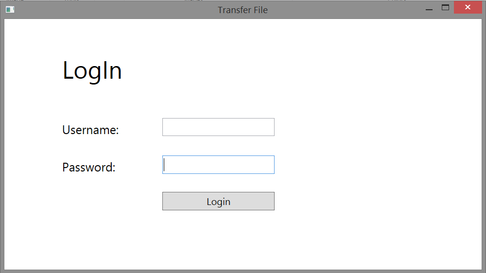
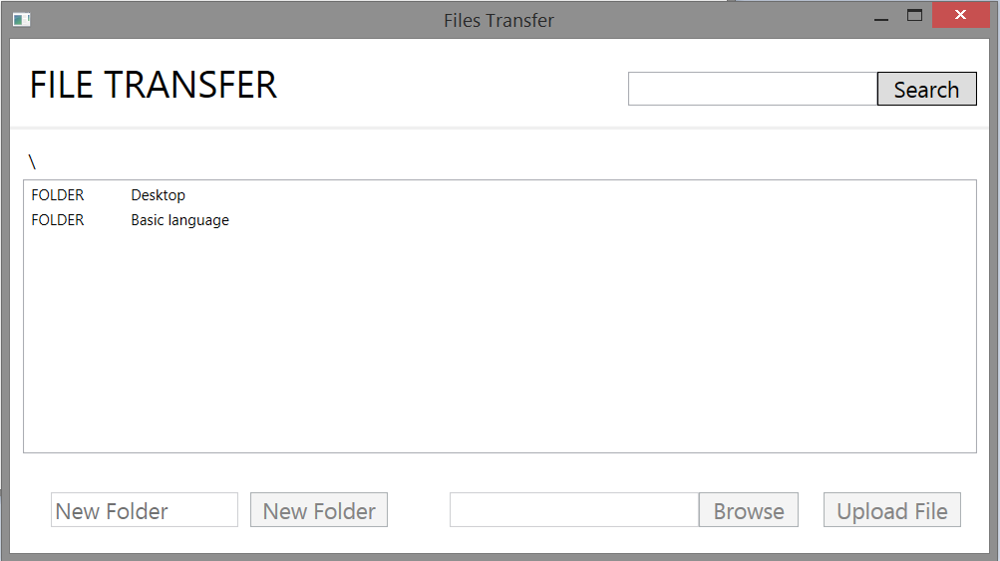
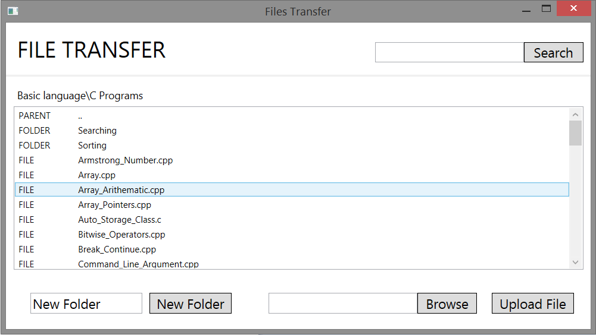
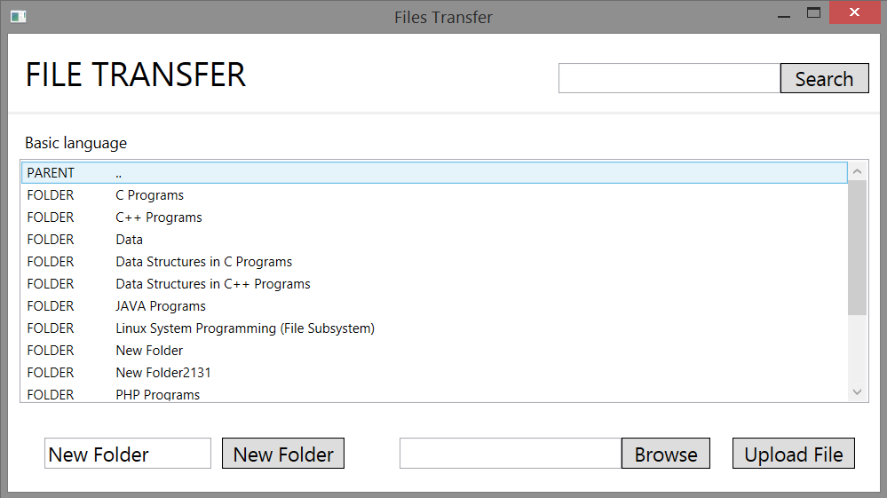
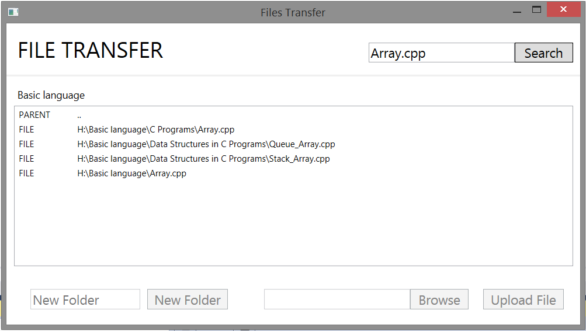
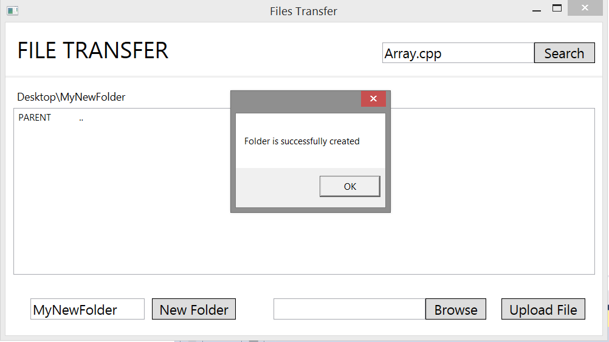
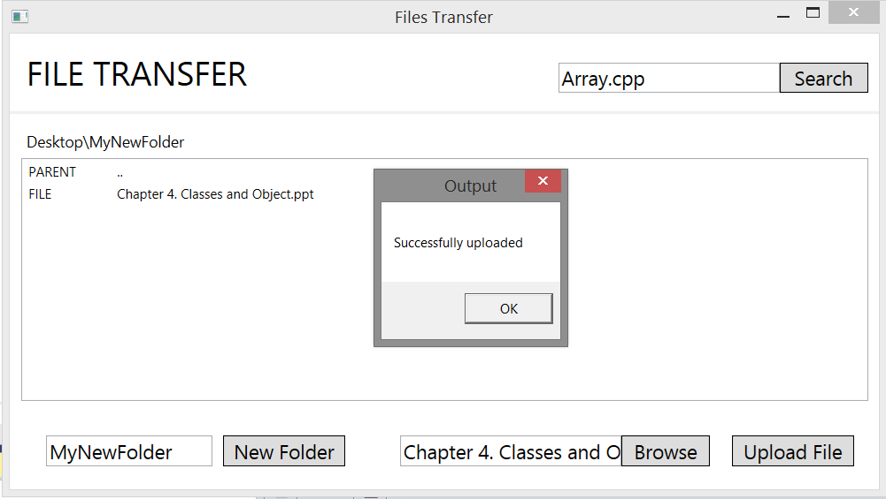
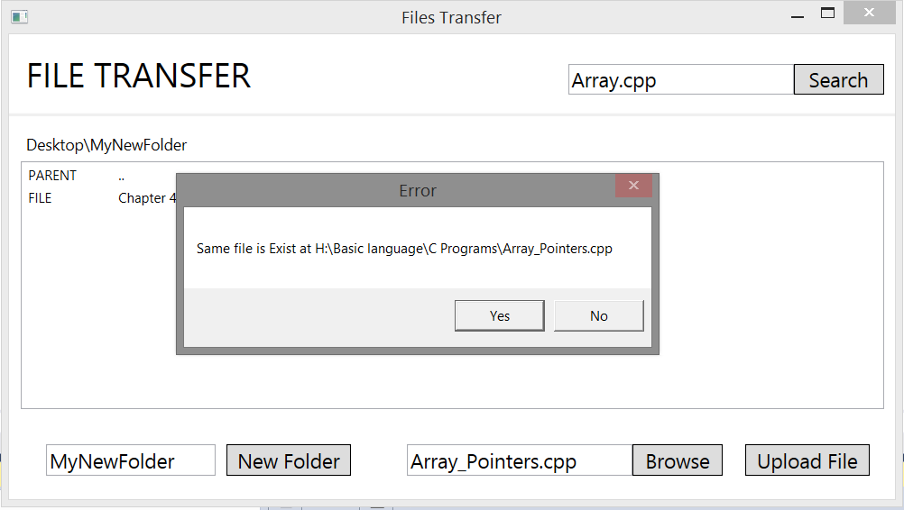

# Remote File Receiver

- This project is demonstration of synchronous Client-Server Application.
- This Application is use to search, list all and download the file from server and it can also upload the file to server.
- Purpose of this Project is to access the folder and file from remote computer.
- Eg If I want some file from computer which is at home. So I can tell someone to start there server application and from laptop I can start client application and search the required file and download it.

## Socket Programming:
- Socket programs are used to communicate between various processes usually running on different systems.
- Is base of all the network programming.

## File Transfer Protocol:
- FTP is used to transfer files between computers on a network.

## Features:
- Socket Programming.
- Download and Upload file.
- Server synchronous connect the client.
- If the server is off then client application will get popup message and application close.
- Authentication.
- Duplicated file is also detected.

## Future Improvement:
- Providing Multiuser.
- Asynchronous server and client.

---

## Project ScreenShot

1. Login Screen.

---

2. Main Window

---

3. Navigation (Seeing the contain of folder)

---

4. Double Dot(..) to go back to parent Folder

---

5. Searching specific file

---

6. Creating new folder at remote location

---

7. Uploading File

---

8. Checking If there is duplicate file present.

---
---